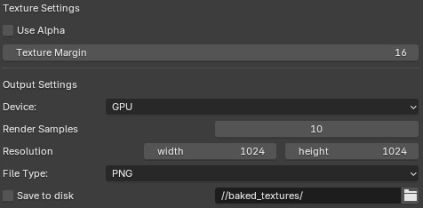

# Texture Patisserie - Blender Add-on

[//]: # (Shields basic info setup)
[shield-release-date]:https://img.shields.io/badge/release_date-2025.06.01-blue
[shield-current-blender-version]:https://img.shields.io/badge/blender_version-4.4.0-red

[//]: # (Shields status setup)
[shield-compatible]:https://img.shields.io/badge/compatible-green
[shield-incompatible]:https://img.shields.io/badge/incompatible-red
[shield-active]:https://img.shields.io/badge/active-green
[shield-disabled]:https://img.shields.io/badge/disabled-red

[//]: # (Shields version setup)
[shield-version-0.0.1]:https://img.shields.io/badge/version-0.0.1-blue
[shield-version-0.0.2]:https://img.shields.io/badge/version-0.0.2-important

[//]: # (Alt texts)
[compatible]:compatible
[incompatible]:incompatible
[active]:active
[disabled]:disabled
[v0.0.1]:v0.0.1
[v0.0.2]:v0.0.2

![v0.0.2][shield-version-0.0.2] ![2025.06.01][shield-release-date] ![4.4.0][shield-current-blender-version] 

A Blender Add-on for streamlining the process of baking and exporting materials to PBR textures in a few clicks. 
Instead of rewrangling nodes and creating textures one by one, you can now batch export materials of your desire as PBR textures ready for use in your preferred game engine!

※This add-on is still being maintained, I will be adding more features whenever I am free or in need of some specific functionalities! :)

<p align="center">
    
</p>

## Version Compatibility
This addon works for blender version 4.4.0 and should be backward compatible. 
However, I haven't checked other for other versions yet since this add-on was initially created for personal use only. 

|Blender version| Add-on Version | Status| 
| ---- | --- | ---- |
| ![4.4.0][shield-current-blender-version] | ![v0.0.2][shield-version-0.0.2] | ![compatible][shield-compatible] |


## Supported Features 

|Name                                          | Description | Version | Status| 
|---|---|---|---|
| PBR texture baking                           | Bake materials into metallic, roughness, albedo, normal maps (more coming soon)                 | ![v0.0.1][shield-version-0.0.1] | ![active][shield-active]    | 
| Principled BSDF baking                       | Bake materials that uses Principled BSDF.                                                       | ![v0.0.2][shield-version-0.0.2] | ![active][shield-active]    |
| Single shader material baking                | Bake materials with only one shader node.                                                       | ![v0.0.2][shield-version-0.0.2] | ![active][shield-active]    | 
| Texture Export                               | Saves texture to defined directory when write to device.                                        | ![v0.0.2][shield-version-0.0.2] | ![active][shield-active]    |
| Batch baking                                 | Baking multiple objects into one texture image for creating texture atlas                       | ![v0.0.2][shield-version-0.0.2] | ![active][shield-active]    | 
| Separate object baking                       | Baking multiple objects into each of their own texture image                                    | ![v0.0.2][shield-version-0.0.2] | ![active][shield-active]    |
| Separate material baking                     | Baking multiple objects and each of their material separately into their own texture image      | ![v0.0.1][shield-version-0.0.1] | ![disabled][shield-disabled]| 
| Texture Output configurations                | Supports selecting render device, samples, resolution, filetype, alpha channel, texture margins | ![v0.0.2][shield-version-0.0.2] | ![active][shield-active]    |   
| Modifiable naming convention and Presets     | User adjustable naming conventions based on the provided presets.                               | ![v0.0.2][shield-version-0.0.2] | ![active][shield-active]    |
| Batch naming convention                      | Allow overriding default object name for batches                                                | ![v0.0.2][shield-version-0.0.2] | ![active][shield-active]    |
| Versioning naming convention                 | Use user specified suffixes when duplicated textures are saved to device                        | ![v0.0.2][shield-version-0.0.2] | ![active][shield-active]    |
| Output directory creation                    | Create subdirectories for both batch and separate baking mode if used                           | ![v0.0.2][shield-version-0.0.2] | ![active][shield-active]    |
-------

# Installation and Usage
Simply download the latest release [here](https://github.com/maythaswang/texture_patisserie/releases/tag/v0.0.2)

Afterwards, open blender and go to `Edit > Preferences > Add-ons`. Click the dropdown icon and select `Install from disk` then select the zip file containing the add-on.

<p align="center">
    
</p>

After the installation is complete, you can find the addon under `Properties Panel > Render > Texture Patisserie` and you are now ready to go!


## UI
Currently I find the add-on yet to be big enough to warrant a proper documentation. With that being said, you can refer to the UI and description below!
### Bake Group Settings
<p align="center">
    
</p>

- The `Bake Selected Maps` button will start the baking process based on the user's configurations.
    -  **Please note that all objects the user preferred to baked must be selected in the viewport**
- The drop down menu under `Bake Grouping Options` determines which bake option to use, currently 2 are available.
    1. Bake Batch: Bakes every object selected into the same texture. Each texture type are not baked into each other. (eg: metallic and normals are separated but object A and B are merged.)
    2. Bake Sepated Object: Bakes every object selected into separated texture but their materials together.
    
### Texture Settings
<p align="center">
    
</p>

- The `Textures to bake option` are checkboxes indication which texture map the user prefers to bake
- `Use Alpha` options will make your clear your albedo background before baking
- `Texture margin` changes the size of margins baking will extrude from the UV island

### Output Settings
<p align="center">
    
</p>

- `Device` refers to the device being used for baking
- `Render samples` referes to the amount of samples which is identical the render setting

### Naming and Versioning
<p align="center">
    
</p>

- The `NAME` section of each output will be set as the object name by default, otherwise if in batch mode, the name will be `batch` by default unless overridden.
- In the `Format` drop down selector, there are 4 available formats to choose from as of now.

As an example, let us use this setup 
```
Name: obj1
Type: NRM
Text1: 4k
Text2: v2
Separator: _
```

|Format                       | Example output       |
|------                       | -----                |
| Name, Type, Text1, Text2    |    obj1_NRM_4k_v2    | 
| Text1, Name, Type, Text2    |    4k_obj1_NRM_v2    | 
| Text1, Text2, Name, Type    |    4k_v2_obj1_NRM    |
| Text1, Type, Name, Text2    |    4k_NRM_obj1_v2    |

- You can override batch name by checking the `Override batch name` and write your own preferred name in the section below
- The following can be said about `Texture type name override` as well.

For versioning 
- By default, the behaviour of this add-on is to create a new texture with a suffixed name such as `obj1_1` `obj1_2` `obj_n` whenever `obj1` exists (or `obj1_{n-1}`)
- You can overwrite the previous file by checking the `Overwrite previous save` checkbox
- Subdirectories can also be created both for normal version and batch version *(Currently there is no versioning available for subdirectories)*

## Example Usage

## Known Issues 
- Export format doesn't conform fully to the specified format.
- The nodes going into different output cannot be the same otherwise there will be issues when rewrangling internally. Right now consider making 

## Notes


In case anyone wants to go through the code. Most files are documented with docstrings, I did try to be as detailed as possible but there are still some disrepancy in conventions between some files so please do we aware of that.

### Future plans (No promises)
- Restructuring the UI 
- Normals swizzle based on engine
- High to Low-poly baking
- Bake Queue and presets
- Channel Packing

## License 
This project is distributed under [GPL-v3.0](LICENSE)
